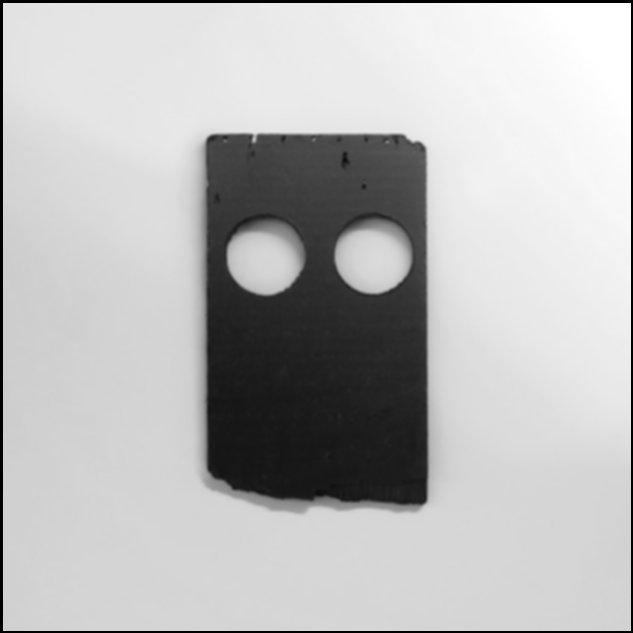
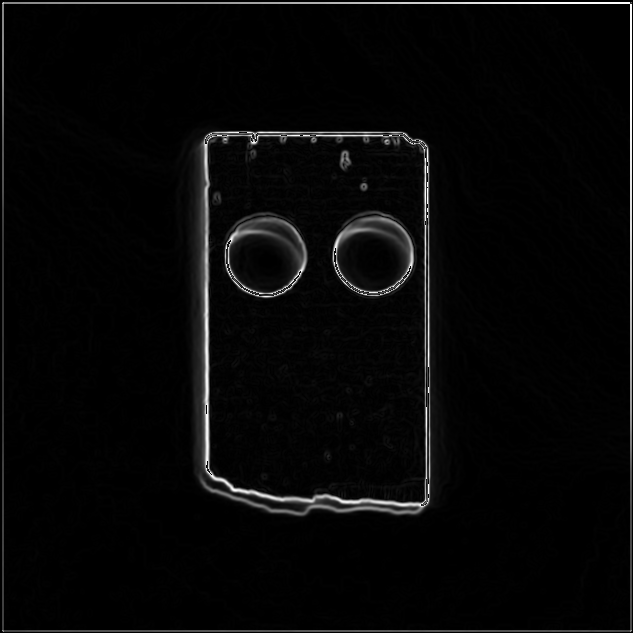
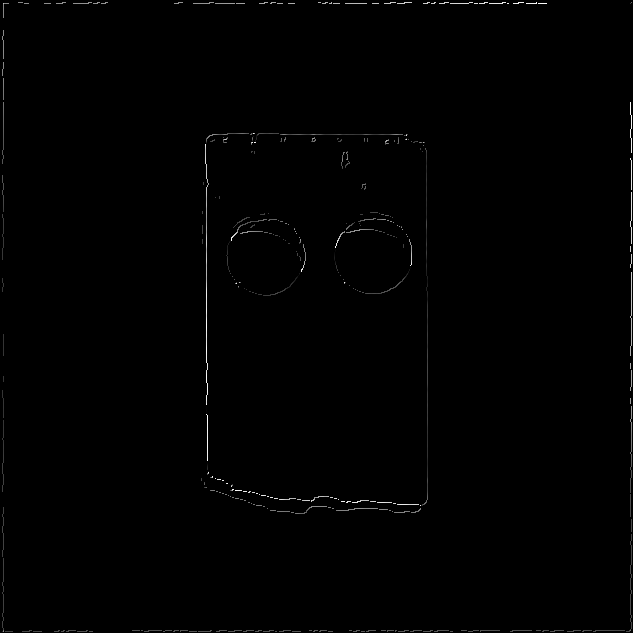
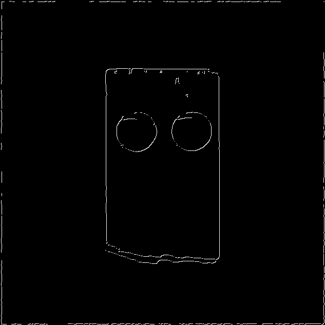

# Results
## Less Noisy Image
### Initial Image

### After Blurring

### Magnitudes

### After Neighbour Comparison

### After Thresholding

### Final Image

## Noiser Image
### Initial Image

### After Blurring

### Magnitudes

### After Neighbour Comparison

### After Thresholding

### Final Image

